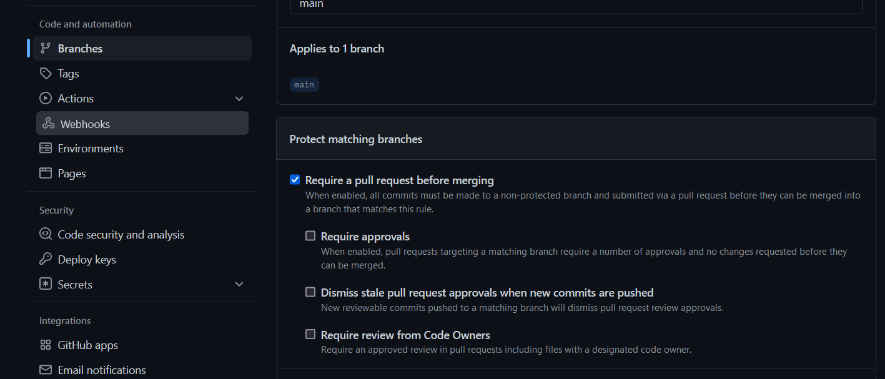

# TP 5 exo pipeline github

## NF7-DO-01



## NF7-DO-02 

_idem_

## NF7-DO-03

```yml
name: Commit Lint 

on: 
  push:
    branches:
      - feature/**
      - hotfix/**

jobs: 
  verifcommit: 
      runs-on: ubuntu-latest
      steps:
        - name: recuperation code 
          uses: actions/checkout@v3

        - name: Commit Linter
          uses: wagoid/commitlint-github-action@v2.0.3
          with:
            configFile: ./commitlint.config.js


``` 

plus ajout du fichier commitlint.config.js a la racine du projet 

```js
module.exports = { extends: ['@commitlint/config-conventional'] };
```

## NF8-DO-01 et NFO-DO-02

```yml
name: Verification test unitaire 

on: 
  pull_request:
    types:
      - opened
    branches:
      - develop


jobs: 
  testunitaire: 
    name: Test Unitaire
    if: startsWith(github.head_ref, 'feature/')
    runs-on: ubuntu-latest
    strategy: 
      fail-fast: true
      matrix: 
        node-version: [14.x, 16.x]
        
    steps:
      - name: recuperation code 
        uses: actions/checkout@v3

      - name: Use Node.js ${{ matrix.node-version }}
        uses: actions/setup-node@v3
        with:
          node-version: ${{ matrix.node-version }}
          cache: 'npm'

      - name: installation des dependance en clean install
        run: npm ci

      - name: lance les test unitaire 
        run: npm run test:coverage > logtest.txt

      - name: création des log de test
        uses: actions/upload-artifact@v3
        with: 
          name: LogTest
          path: logtest.txt

```

## NF4-DO-01

```yml
name: Creation branch après assignation d'un issue

on:
  issues:
    types: [ assigned ]
  issue_comment:
    types: [ created ]
  pull_request:
    types: [ closed ]

jobs:
  create_issue_branch_job:
    runs-on: ubuntu-latest
    steps:
      - name: Create Issue Branch
        uses: robvanderleek/create-issue-branch@main
        with:
          branchName: 'feature/${issue.number}-${issue.title}'
          defaultBranch: 'develop'
        env:
          GITHUB_TOKEN: ${{ secrets.GITHUB_TOKEN }}
```

## NF8-DO4

```yml
name: Merge PRs
on:
  pull_request:
    types:
      - opened
      - closed
      - edited
      - reopened
jobs:
  automerge:
    runs-on: ubuntu-latest
    steps:
      - name: Delete merged branch
        uses: koj-co/delete-merged-action@master
        with:
          branches: "!main, !develop, *"
        env:
          GITHUB_TOKEN: "${{ secrets.GITHUB_TOKEN }}"
```


